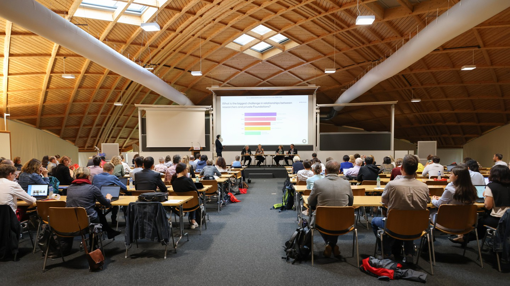

User: 

AI: The image shows a conference room scene where several people are seated facing a large screen displaying a presentation slide titled "What is the biggest challenge in relationships between researchers and private foundations?" The slide includes a bar graph with different color bars representing various challenges, such as yellow, red, green, and purple. The audience—adults dressed in business and casual attire—seems attentive, with some taking notes. A panel consisting of four individuals is seated at the front. The background of the room has a

User: Is there any seats empty where I can sit?

AI: In the image, there are a few empty seats available where you can sit. There are empty spots mostly near the back of the room. Some of these seats are dispersed among the rows, so you should be able to find a place without much difficulty.

User: How many people you can see?

AI: Considering the provided context, I can see around 40 people in the conference room. Please let me know if you have any more specific questions or if you need help with anything else!
