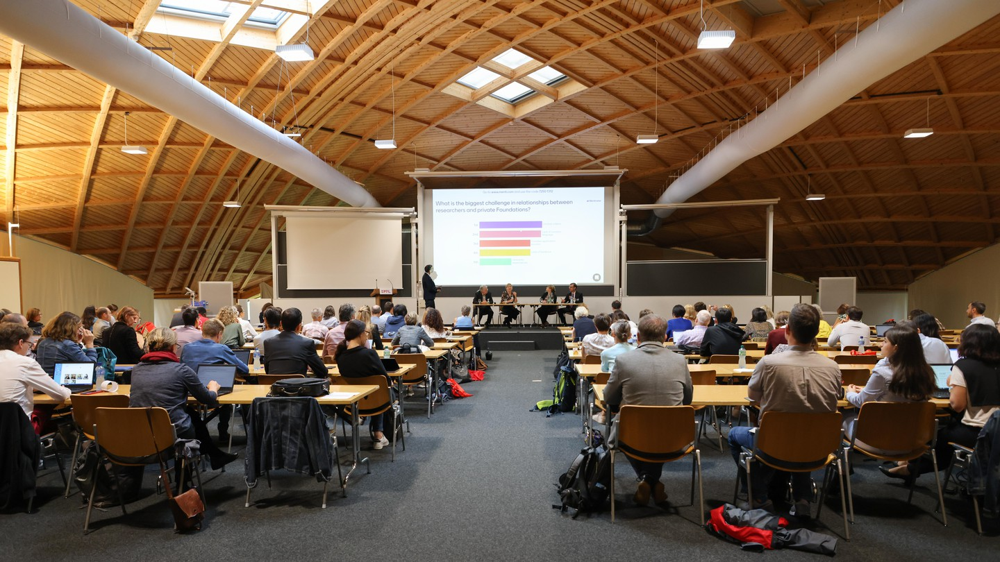

User: 

AI: The image displays a conference or seminar scenario in a hall featuring a wooden arched ceiling. In the front, there is a panel discussion ongoing with five individuals seated at a table. There’s a large screen displaying a PowerPoint presentation, which includes a colorful bar graph and the question, "What is the biggest challenge in relationships between researchers and private Foundations?" The hall is filled with attendees seated at rectangular tables, most of whom are attentively watching the presentation and taking notes. The color scheme includes various tones

User: How many people there are in the classroom?

AI: Based on the context provided and the image, it appears there are approximately 40-50 people in the hall attending the conference or seminar.

User:Where I can find a place to sit?

AI: There appears to be some available seating towards the back of the hall. You might find empty chairs in the last few rows. If they are occupied, you can also look for any unclaimed spots at the tables where attendees have placed only their belongings like bags or jackets. Asking politely to share the table where seating is partially occupied is another option to consider.

User:Is the teacher or anyone speaking?

AI: Currently in the image, someone is speaking, presumably a teacher or presenter, as they stand in front of the large screen with a pointer or similar device in hand, addressing the panel and the audience.

