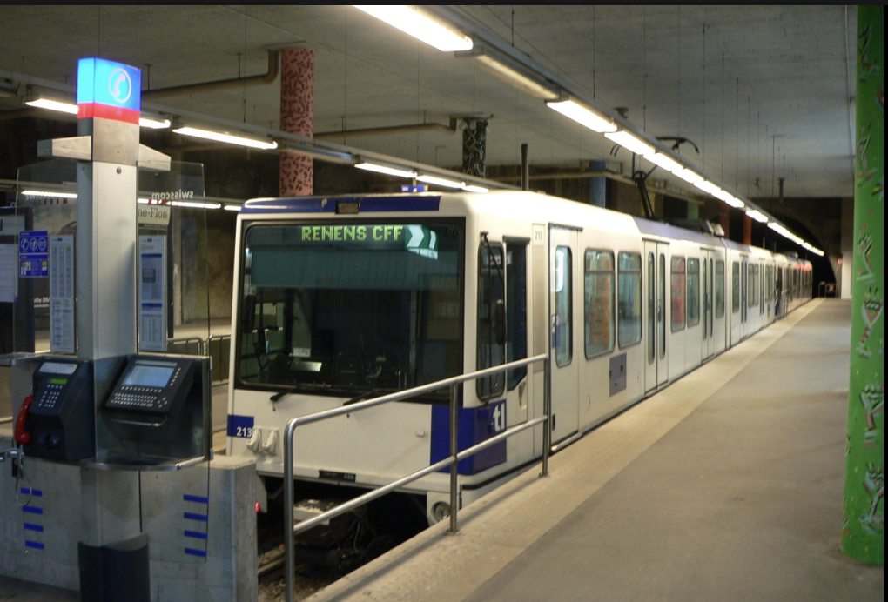

User: 

AI: The image depicts an underground train station with a parked tram labeled "RENENS CFF." In the foreground, there are ticket vending machines with a prominent blue and red color on a payment verification pillar. The tram itself is predominantly white with a blue stripe and minor elements of other colors on its doors due to ads or graffiti. The station’s background features utilitarian, unfinished gray concrete walls, some of which are also adorned with colorful graffiti. No people are visible in this particular shot. There is visible

User: Are the door of the train open? 

AI: In the image, the doors of the tram labeled "RENENS CFF" appear to be closed. This is evident as no gap or open space is visible between the doors on the visible side of the tram.
Make a new question....Is this a tram station?

User: Is this a tram station? 

AI: No, this is not strictly a tram station; it appears to be a train station, as indicated by the sign "RENENS CFF" which is associated with CFF (Swiss Federal Railways). The setting suggests a multi-modal transportation hub, which commonly serves both trains and trams, but the specific signage and infrastructure lean more towards a train station environment.